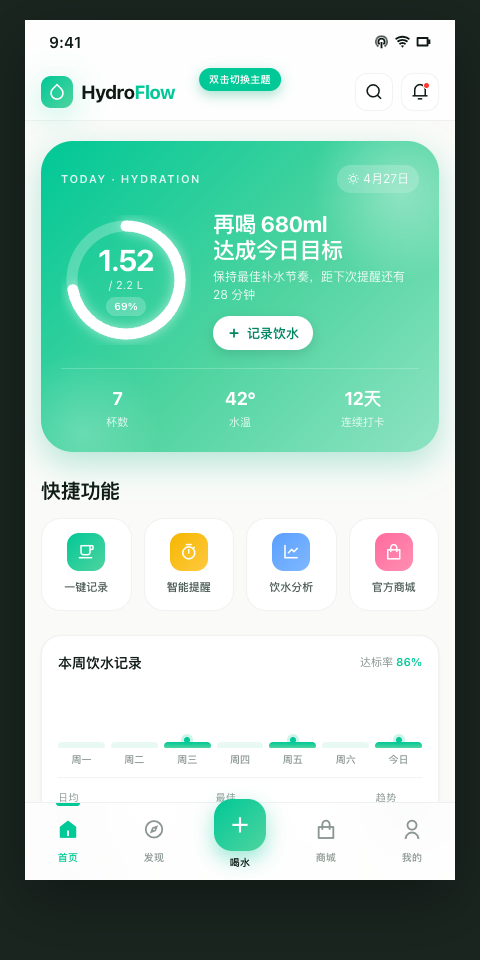
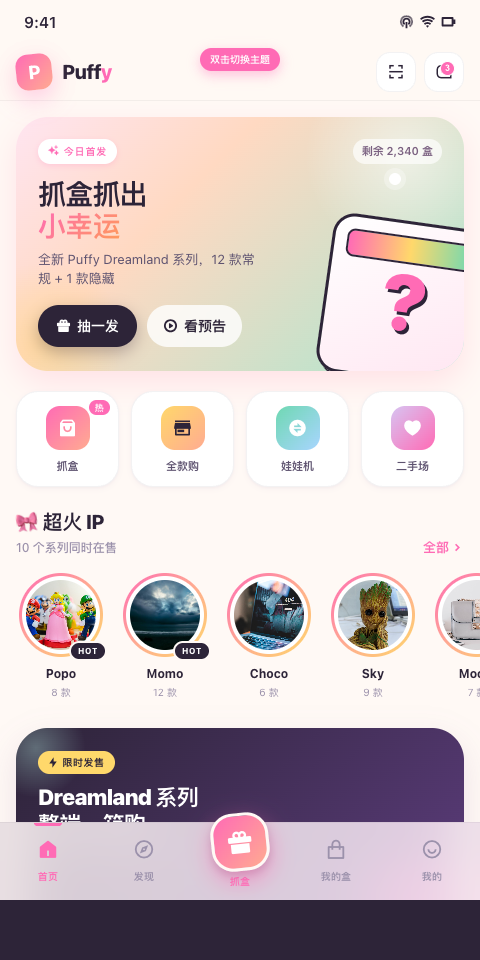
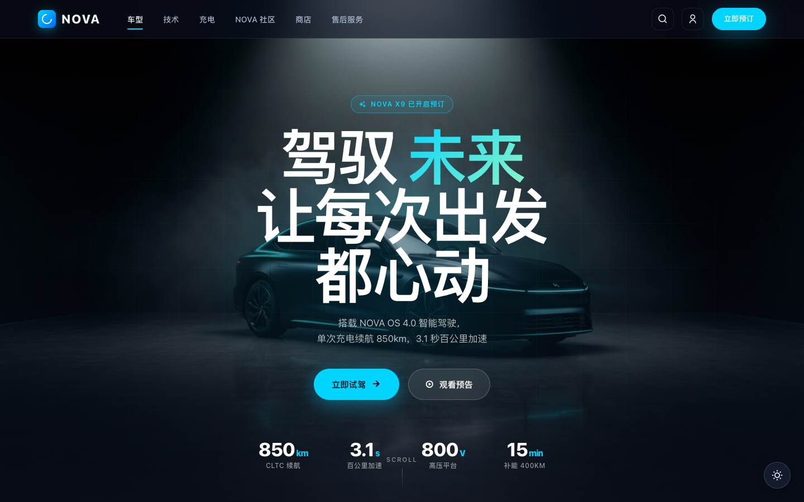

# apple-design-skill

> Apple HIG 风格 UI 生成 skill。让 WorkBuddy / CodeBuddy 产出真·Apple 质感的界面 —— iOS、macOS、iPadOS、Web 落地页都能用。

**版本**：v1.5.0
**作者**：Dayvi
**许可**：MIT

---

## 这个 skill 能干什么

当你对 AI agent 说：
- "做一个简洁现代的 App 首页"
- "帮我设计一个带毛玻璃效果的 landing page"
- "我想要 iOS 风格 / macOS 风格的 UI"
- "高端、优雅、premium feel"
- "frosted glass、clean、minimal"

它会**自动加载这套规范**，按 Apple HIG 的设计语言生成页面，带完整的：
- ✅ SF Pro 字体 + 4pt 栅格
- ✅ Apple 系统色 token（Light / Dark Mode）
- ✅ 毛玻璃（`backdrop-filter`）
- ✅ 单滚动容器 + Sticky 架构（Header / Tab Bar 粘在手机屏幕顶/底，毛玻璃真正生效）
- ✅ 双击 Status Bar 切换主题的 iOS 原生交互
- ✅ 7 大类 × 20+ 套调色板（Vintage / Pastel / Neon / Nature / Sunset / Dark Premium / Seasonal）
- ✅ 响应式（Desktop-first → Pad → Mobile）
- ✅ Remix Icon 图标体系

---

## 怎么安装

### 方式一：解压到 user-level skill 目录（推荐，全局可用）

```bash
# 解压整个 apple-design-skill/ 目录到 ~/.workbuddy/skills/
unzip apple-design-skill-v1.5.0.zip -d ~/.workbuddy/skills/

# 验证
ls ~/.workbuddy/skills/apple-design-skill
# 应看到：SKILL.md / assets/ / references/ / scripts/
```

### 方式二：放到项目本地（仅当前项目可用）

```bash
# 放到项目的 .workbuddy/skills/ 目录
unzip apple-design-skill-v1.5.0.zip -d /path/to/your/project/.workbuddy/skills/
```

### 方式三：WorkBuddy 客户端"导入本地 skill 包"

在 WorkBuddy 桌面端 → 技能市场 → 导入本地 skill 包 → 选中这个 zip 文件。

---

## 怎么用

安装后**什么都不用做**。跟 AI 对话时用以下关键词任意之一触发：

| 触发词 | 示例 |
|--------|------|
| Apple 风格 | "做一个 Apple 风格的 app 首页" |
| iOS / macOS | "iOS 风格的设置页面" |
| 毛玻璃 / frosted glass | "加个毛玻璃导航栏" |
| 简洁 / 高级 / premium | "高级感的产品页" |
| minimal / clean | "minimal clean landing page" |
| 复古 / 奶油 / 霓虹 / 森林 / 暮色 | 调色板关键词会命中 Step 1A.2 的 20+ 套预设 |

AI 会先问你 2 件事：
1. **配色方向**（科技蓝 / 自然绿 / 活力橙 / 中性 / 自定义，或任何调性关键词）
2. **目标设备**（Web / Mobile / Pad / 多端）

然后直接出 HTML + 内联 CSS，单文件可预览。

---

## 作品集（Examples）

完整可预览的三个案例，覆盖 Mobile App / Web 官网 / AI 图生图三种场景：

| 项目 | 类型 | 主题 | 预览 |
|------|------|------|------|
| **HydroFlow** | Mobile App | 薄荷绿运动水壶 |  |
| **PUFFY** | Mobile App | 奶油马卡龙潮玩盲盒 |  |
| **NOVA** | Web 官网 | 暗色科技新势力电车 |  |

源码全部在 [`examples/`](./examples/) 目录，详见 [examples/README.md](./examples/README.md)。

---

## 目录结构

```
apple-design-skill/
├── SKILL.md              # 主文档（60+ KB，所有规则在这）
├── README.md             # 这个文件
├── references/
│   └── design-system.md  # 完整 token 参考（颜色/字体/spacing/阴影/动效）
├── assets/               # （预留）
└── scripts/              # （预留）
```

## 核心规范速查

| 规则 | 位置 |
|------|------|
| Color Hunt 风格调色板库（7 大类 20+ 套） | Step 1A.2 |
| 单台手机 + 双击顶部切换主题 | Step 5.2 |
| 单滚动容器 + Sticky 架构（毛玻璃真生效） | Step 5.6 |
| Remix Icon 图标规则 | Step 5.5 |
| Dual Mode Output 质量 checklist | Step 9 |
| Unsplash 优先 + AI 兜底决策树 | Step 10.0 |

---

## 迭代历史

- **v1.5.0** (2026-04-28)
  - 新增 Step 1A.2 Color Hunt 风格化主题库（Vintage / Pastel / Neon / Nature / Sunset / Dark Premium / Seasonal 七大类，20+ 套精选 4 色调色板）
  - 新增 Step 10.0 图片工作流决策树（Unsplash 优先 + AI 兜底，禁止未询问直接切 AI）
- **v1.4.0** (2026-04-27)
  - 重写 Step 5.6：单滚动容器 + Sticky 架构（取代 Flex 三层 / 自适应高度）
  - Step 5.2：固定设备高度 + 直角外框 + 双击 Status Bar 切换
- **v1.0.0** (2026-04-14)
  - 初版：SF Pro + 系统色 + 4pt 栅格 + 组件 pattern + glassmorphism + Spring 动效

---

## 问题反馈

如果发现 skill 在某个场景下触发不准或产出不对味，欢迎提 issue 给我。
